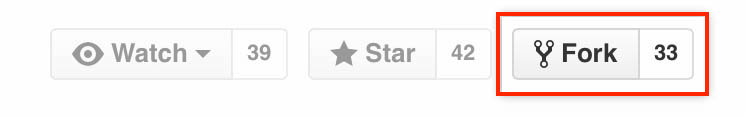

# Daily Exercise 04: 
### Geography 176A Summer 2020

*****

#### Directions:

##### 1. Fork this repo: In the top-right corner of this page, click Fork.

##### 2. From your version (`YOUR USERNAME/exercise-04`), copy the git URL

##### 3. CLONE it via RStudio to create a new project

`File --> New Project --> Version Control --> Git`

   a. paste the URL
   b. keep the name
   c. make as a subdirectory of `~/github`

##### 4. Review the .Rmd file in the `docs` folder to complete the assignment.

##### 5. Submit the required image and URL to Guachospace

